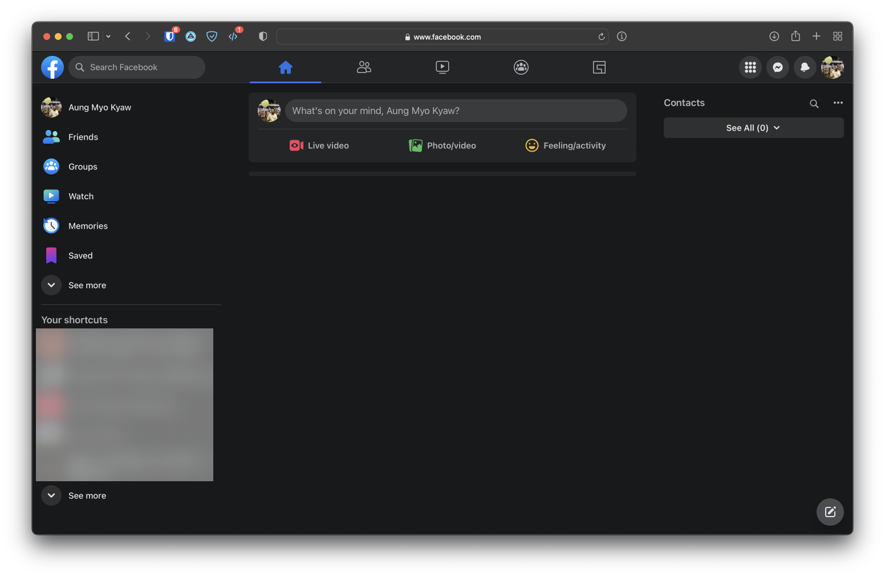

  <h1 align="center">clean fb newsfeed</h1>
  
   
   

---

- fb ကို logout လည်း လုပ် မထား ချင်ဘူး ။
- သူများ တင် တဲ့ ပိုစ့် တွေ ကို လည်း မကြည့်ချင်ဘူး ။
- ကိုယ် ပဲ တင် ချင်တယ်
- [safari](https://www.apple.com/safari/) ပဲ သုံး ချင်တယ်

_*ထို့ကြောင့်*_

---

- install [ userscripts extension ](https://apps.apple.com/us/app/userscripts/id1463298887) first
- install [ clean fb news feed scripts ](https://raw.githubusercontent.com/AungMyoKyaw/clean-fb-newsfeed/master/release/clean-fb-newsfeed.user.js)

---

## demo ss

## License

MIT © [Aung Myo Kyaw](https://github.com/AungMyoKyaw)
